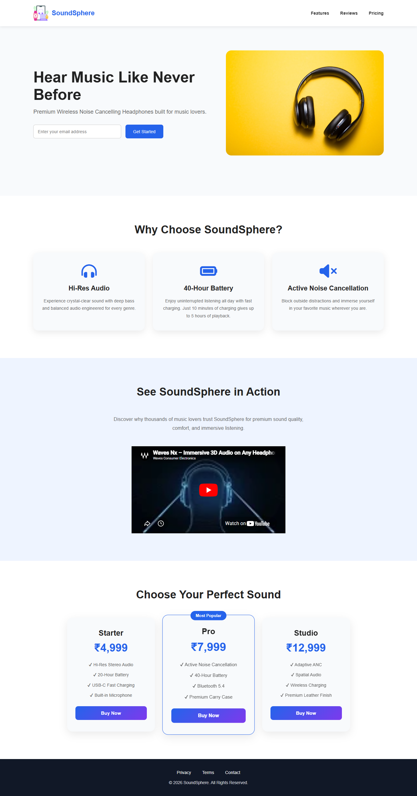

# 🎧 SoundSphere Landing Page

A modern, responsive product landing page for **SoundSphere**, a fictional premium wireless headphones brand. The website showcases product features, pricing plans, an embedded promotional video, and a clean, user-friendly interface designed to deliver an engaging browsing experience across desktop and mobile devices.

This project focuses on responsive layouts, modern UI design, semantic HTML, and CSS styling to create a polished marketing website.

---

## ✨ Features

- Responsive landing page layout
- Fixed navigation bar with smooth scrolling
- Hero section with email subscription form
- Product feature cards with Font Awesome icons
- Embedded YouTube promotional video
- Pricing section with a highlighted featured plan
- Modern footer with navigation links
- Responsive design using CSS media queries

---

## 🛠️ Tech Stack

- HTML5
- CSS3
- Font Awesome
- YouTube Embed (iframe)

---

## 📸 Preview

### Full Page



---

## 📂 Project Structure

```text
soundsphere-landing-page/
│
├── assets/
│   └── preview-1.png
│
├── index.html
├── styles.css
└── README.md
```

---

## 📚 What I Practiced

- Semantic HTML5
- Flexbox layouts
- Responsive web design
- CSS media queries
- Fixed navigation
- Responsive forms
- CSS transitions and hover effects
- Pricing card design
- Embedding multimedia content
- Working with external libraries (Font Awesome)

---
