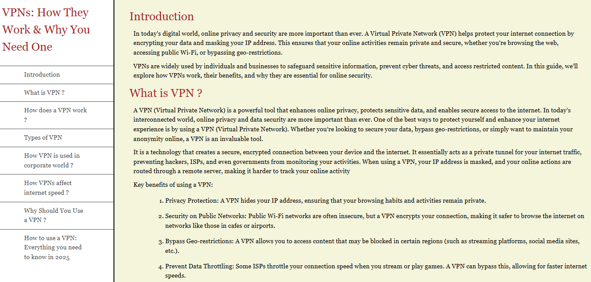
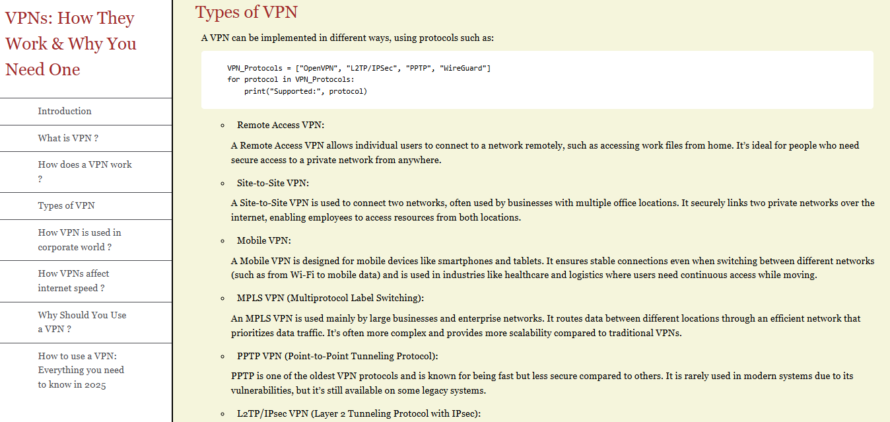

# 📘 Technical Documentation Page – VPNs: How They Work & Why You Need One

A responsive technical documentation website that explains the fundamentals of Virtual Private Networks (VPNs), including how they work, their different types, real-world applications, and why they are important for online privacy and security.

The project features a fixed sidebar navigation, responsive layout, code snippets, and a structured documentation format designed to provide an easy reading experience across desktop and mobile devices.

---

## 🚀 Features

* Responsive technical documentation layout
* Fixed sidebar navigation with smooth section linking
* Semantic HTML5 structure
* Mobile-friendly design using CSS media queries
* Code examples displayed with dedicated code blocks
* Organized content with headings, lists, and articles
* Clean and readable typography

---

## 🛠️ Tech Stack

* HTML5
* CSS3

---

## 📸 Preview

### Desktop View



### Mobile / Responsive View



---

## 📂 Project Structure

```text
technical-documentation-page/
│
├── assets/
│   ├── preview-1.png
│   └── preview-2.png
│
├── index.html
├── styles.css
└── README.md
```

---

## 📚 What I Practiced

* Semantic HTML elements
* Responsive layouts
* Fixed positioning
* Flexbox
* Media Queries
* Internal page navigation
* Typography and spacing
* CSS styling best practices

